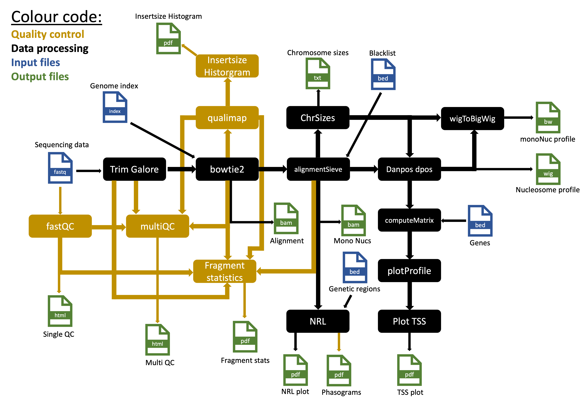

# nucDetective

## Introduction
nucDetective is a two step automated pipeline for the analysis of nucleosome positions and nucleosome dynamics among alternating sampling conditions.
The pipeline contains two main workflows:

1. `Profiler` for alignments, qualitycontrol and nucleosome calling
2. `Inspector` for analysis of nucleosome dynamics

### Profiler

	
    *Workflow Profiler*

Given paired-end sequencing data in fastq format, this pipeline will first run `profiler`:

`Profiler` processes given fastq files to align them to a given genome and call nucleosome positions.
`Profiler` returns a "QC" and a "RUN" folder. 
    The "QC" folder contains:
        1. FastQC reports on raw data
        2. Trimming reports
        3. Trimmed fastQC reports
        4. Alignment statisics and fragmentsize Plots
        5. Qualimap reports
        6. Filtering reports
        7. Fragment statisics
        8. Phasograms
        9. MultiQC reports

    The "RUN" folder contains:
        1. Alignments
        2. Nucleosome profiles
        3. TSS profile plot
        4. NRL plot