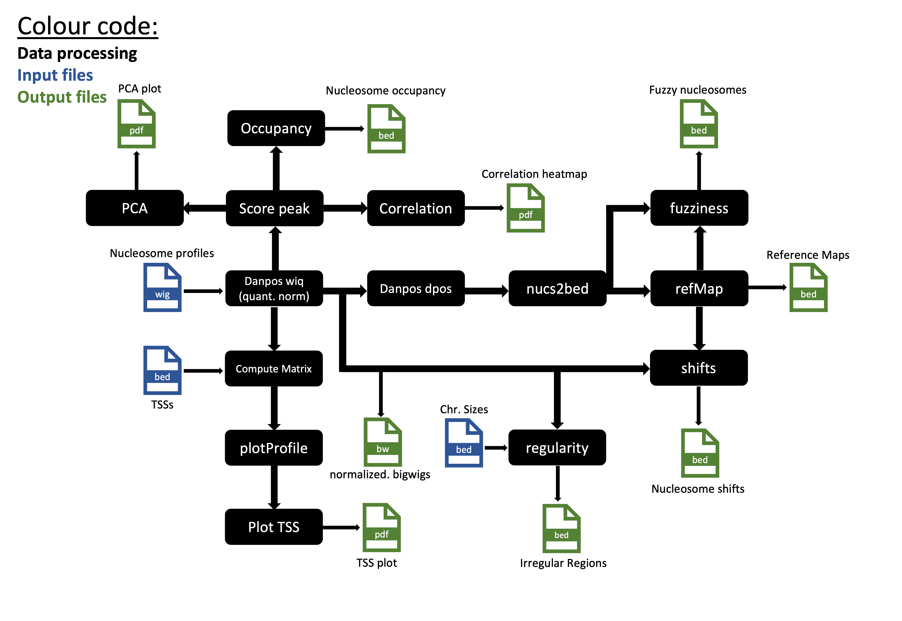

# nucDetective

## Introduction
nucDetective is a two step automated pipeline for the investigation of nucleosome positions and nucleosome dynamics among MNase-Seq data generated using varying conditions.
The pipeline contains two main workflows:

1. `Profiler` for alignments, qualitycontrol and nucleosome calling
2. `Inspector` for analysis of nucleosome dynamics

### Profiler

<p align="center">
                    Workflow Profiler
	
    
</p>

Given paired-end sequencing data in fastq format, this pipeline will first run `Profiler`:

* The `Profiler` workflow can be seperated into two main branches: Data processing and QC.
    * Data processing:
        1. Trimming of reads using [`Trim Galore`](https://github.com/FelixKrueger/TrimGalore)
        2. Alignment of reads to a provided genome index using [`bowtie2`](https://github.com/BenLangmead/bowtie2)
        3. Fragment filtering using [deepTools](https://github.com/deeptools/deepTools/tree/master) `alignmentSieve`
            Filtering can be adapted by: 
            1. Providing a .bed file with blacklisted regions (often mitochondrial chromosomes)
            2. Changing min or max length of fragments
        4. Nucleosome calling using [`danpos dpos`](https://sites.google.com/site/danposdoc/b-documentation/1-dpos)
        5. Generating a TSS plot using [deepTools](https://github.com/deeptools/deepTools/tree/master) `computeMatrix` and `plotProfile`
        6. Calculating Nucleosome repeat lengths and plotting them

    * QC
        1. QC using [`fastQC`](https://github.com/s-andrews/FastQC) on raw and processed reads
        2. Insertsize histogram generation from [`qualimap`](http://qualimap.conesalab.org/) processed [`bowtie2`](https://github.com/BenLangmead/bowtie2) data
        3. [`MultiQC`](https://multiqc.info/) combining information of [`qualimap`](http://qualimap.conesalab.org/), [`Trim Galore`](https://github.com/FelixKrueger/TrimGalore), [`bowtie2`](https://github.com/BenLangmead/bowtie2) and [`fastQC`](https://github.com/s-andrews/FastQC)
        4. Fragment statistics combining inforamtion of [`qualimap`](http://qualimap.conesalab.org/), [`Trim Galore`](https://github.com/FelixKrueger/TrimGalore), [`bowtie2`](https://github.com/BenLangmead/bowtie2), [deepTools](https://github.com/deeptools/deepTools/tree/master) `alignmentSieve` and [`fastQC`](https://github.com/s-andrews/FastQC)


#### Output
* `Profiler` returns a "QC" and a "RUN" folder. 
   * The "QC" folder contains:
    1. FastQC reports on raw data
    2. Trimming reports
    3. Trimmed fastQC reports
    4. Alignment statisics and fragmentsize Plots
    5. Qualimap reports
    6. Filtering reports
    7. Fragment statisics
    8. Phasograms
    9. MultiQC reports

   * The "RUN" folder contains:
    1. Alignments
    2. Nucleosome profiles
    3. TSS profile plot
    4. NRL plot

### Inspector
Once `Profiler` is completed the `Inpector` can be instructed to analyze nucleosome dynamics.

<p align="center">
                    Workflow Inspector
	
    
</p>

* The `Inspector` requires the nucleosome profiles generated by the `Profiler`.
   * The `Inspector` workflow:
        1. Quantile normalisation of nucleosome profiles by [danpos wiq](https://sites.google.com/site/danposdoc/b-documentation/7-wiq)
        2. Generating a TSS plot using [deepTools](https://github.com/deeptools/deepTools/tree/master) `computeMatrix` and `plotProfile`
        3. Peak scoring by [deepTools](https://github.com/deeptools/deepTools/tree/master) `multiBigwigSummary`
        4. Correlation plot by [deepTools](https://github.com/deeptools/deepTools/tree/master) `plotCorrelation`
        5. PCA plot by [deepTools](https://github.com/deeptools/deepTools/tree/master) `plotPCA`
        6. Analysis of nucleosome occuancy
        7. Defining regions of low regularity between samples
        8. Define nucleosome shifts between samples
        9. Define fuzzy nucleosomes

#### Output
* `Inspector` returns a "RUN" folder.
   * The folder contains:
    1. Normalized nucleosome profiles
    2. TSS profile plot
    3. Nucleosome reference maps, nucleosome bed files and top 20% best positioned among conditions nucleosome
    4. Nucleosome scores
    5. PCA and correlation heatmap of normalized profiles
    6. Fuzzy nucleosomes, regions of high nucleosome occupancy changes, regions of high nucleosome shifts
    7. Regions with high changes in regularity and Power spectral density

## Get started

### Requirements

* `Docker` and `nextflow` are required to run the nucDetective pipeline. Additional software used in the pipeline is packaged in Docker containers and is automatically downloaded during the first execution of the pipeline.
* The pipeline is compatible with all computational infrastructures. Executing the pipeline on cloud or HPC systems may require to adapt the [`nextflow.config`](https://www.nextflow.io/docs/latest/basic.html).
* The pipeline requires paired-end sequencing data
* Bowtie2 index of reference genome, reference genome in fasta format and the length of the mappable genome.

### Installation
You can obtain the pipeline directly from GitHub:
```bash
git clone https://github.com/LeSch1/nucDetective.git
```

### Usage
First you need to run the `Profiler` workflow. We recommend to assess "QC" output before running the next step. Then take the output and run `Inspector`.  
Files will be sorted alphabetically, we therfore recommend naming files accordingly. 
* Example:
    01 to 20 rather than 1 to 20


To execute the pipeline a sample sheet is required for each workflow. See examples below.

Workflow:

* `Profiler` (structural example)

```csv
Sample_Name,path_fwdReads,path_revReads,Condition
name1,data/name1/fwd.fastq.gz,data/name1/rev.fastq.gz,cond1
name2,data/name2/fwd.fastq.gz,data/name2/rev.fastq.gz,cond2
name3,data/name3/fwd.fastq.gz,data/name3/rev.fastq.gz,cond3
```
Each row represents a pair of fastq files. Here unique sample names are required.


* `Inspector` (structural example)

```csv
Sample_Name,path_wig,normalize,condition
name1,/Profiler/RUN/01_NUCLEOSOME_PROFILE/wig/name1_profile.wig,Norm,cond1
name2,/Profiler/RUN/01_NUCLEOSOME_PROFILE/wig/name2_profile.wig,Norm,cond2
name3,/Profiler/RUN/01_NUCLEOSOME_PROFILE/wig/name3_profile.wig,Norm,cond3
```
Each row represents a normalized nucleosome profile file.

**Execute:**

* `Profiler`
```bash
nextflow run /nucDetective/ \
--analysis 'profiler' \
--csvInput '/fastqIN.csv' \
--outDir '<OUTDIR>' \
--genomeIdx '/bowtie2idx' \
--publishBam  --publishBamFlt \
--genomeSize <GENOMESIZE> \
--minLen 75 --maxLen 175 \
--blacklist '/blacklist.bed' \
--TSS '/Annotationfile.bed' \
-w ./work_profiler
```
All options, except `--publishBamFlt`,`--blacklist`, and `--TSS`, are required.   


* `Inspector`
```bash
nextflow run /nucDetective/ \
--analysis 'inspector' \
--csvInput '/wigIN.csv' \
--outDir '<OUTDIR>' \
--chrSizes '/chrom_Sizes.txt' \
--genomeSize <GENOMESIZE> \
--TSS '/Annotationfile.bed' \
-w ./work_inspector
```
All options, except `--TSS`, are required.   
